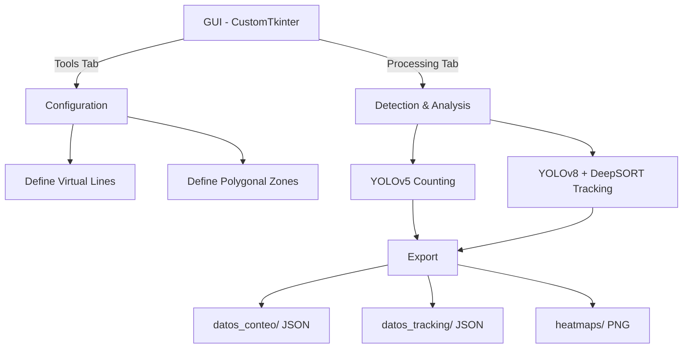

<div align="center">


# Pharmacy People Counting & Tracking System

**Computer vision-powered customer flow analysis for retail pharmacies**

[](https://python.org)
[](https://github.com/ultralytics/yolov5)
[](https://github.com/ultralytics/ultralytics)
[](https://opencv.org)
[](LICENSE)

<br>

[**Leer en Espanol**](README_ES.md)

</div>

---

## Overview

Master's Thesis (TFM) project: a real-time system for **counting and tracking people** inside pharmacies using deep learning. It detects customers with YOLO, tracks them with DeepSORT, analyzes dwell time per zone, and generates heatmaps — all with built-in **GDPR-compliant privacy** (real-time pixelation, local processing only).

---

## Key Features

<table>
<tr>
<td width="50%">

**Detection & Counting**
- YOLOv5 person detection with virtual counting lines
- Entry/exit tracking with real-time totals
- Configurable confidence thresholds
- JSON export of all counting data

</td>
<td width="50%">

**Tracking & Analytics**
- YOLOv8 + DeepSORT persistent tracking
- Polygonal zone definition with dwell time
- Automatic heatmap generation
- Per-person trajectory and zone history

</td>
</tr>
<tr>
<td width="50%">

**Privacy & Compliance**
- Real-time face/body pixelation (toggle with `P`)
- 100% local processing — no external data transfer
- GDPR compliant by design

</td>
<td width="50%">

**User Interface**
- Desktop GUI built with CustomTkinter
- Interactive line and zone configuration tools
- Integrated video preview and controls
- One-click processing start/stop

</td>
</tr>
</table>

---

## Gallery

### Main Interface

|  |  |
| :---: | :---: |
| *Control panel* | *Processing & real-time controls* |

### Configuration Tools

|  |  |
| :---: | :---: |
| *Virtual counting lines* | *Polygonal zone definition* |

### Counting & Tracking

|  |  |
| :---: | :---: |
| *Real-time people counting* | *Privacy pixelation enabled* |

|  |  |
| :---: | :---: |
| *DeepSORT trajectory tracking* | *Generated heatmap* |

---

## Architecture



---

## Tech Stack

<p align="center">
  
  
  
  
  
  
  
</p>

---

## Quick Start

### Prerequisites

- Python 3.8+
- pip

### Installation

```bash
git clone https://github.com/patatapython/Sistema-Tracking-Farmacia.git
cd Sistema-Tracking-Farmacia
python -m venv venv
source venv/bin/activate  # Linux/Mac
# venv\Scripts\activate   # Windows
pip install -r requirements.txt
```

### Download YOLO Models

```bash
# YOLOv5s (~15MB)
wget https://github.com/ultralytics/yolov5/releases/download/v7.0/yolov5s.pt
# YOLOv8s (~22MB)
wget https://github.com/ultralytics/assets/releases/download/v8.2.0/yolov8s.pt
```

### Run

```bash
python uiFarmacia_logo.py
```

---

## Usage

1. **Configure** (Tools tab): define counting lines and polygonal zones interactively
2. **Process** (Processing tab): select video source, start counting or tracking
3. **Analyze**: results are automatically exported to `datos_conteo/`, `datos_tracking/`, and `heatmaps/`

<details>
<summary><b>Output data formats</b></summary>

**Counting** (`datos_conteo/*.json`):
```json
{
  "entradas": 15,
  "salidas": 12,
  "total_personas": 27,
  "personas_dentro": 3,
  "timestamp": "2025-09-05T14:42:45.598Z"
}
```

**Tracking** (`datos_tracking/*.json`):
```json
{
  "timestamp": "20250905_144534",
  "total_personas": 5,
  "sistema_tracking": "DeepSORT",
  "personas": [
    {
      "id": 1,
      "zona_actual": "mostrador",
      "tiempo_en_zona_actual": 45.2,
      "historial_zonas": [
        {
          "zona": "entrada",
          "tiempo_entrada": "2025-09-05T14:40:00",
          "tiempo_salida": "2025-09-05T14:40:30",
          "duracion": 30.0
        }
      ]
    }
  ]
}
```

</details>

---

## Project Structure

```
Sistema-Tracking-Farmacia/
├── uiFarmacia_logo.py      Main GUI application
├── conteo.py               YOLOv5 people counting module
├── tracking.py             YOLOv8 + DeepSORT tracking module
├── crear_linea.py          Interactive counting line creator
├── crear_zonas.py          Interactive polygonal zone creator
├── config/                 Line and zone configuration files
├── datos_conteo/           Counting results (JSON)
├── datos_tracking/         Tracking results (JSON)
├── heatmaps/               Generated heatmap images (PNG)
├── extras/Imagenes/        Screenshots for documentation
├── Logo/                   Application logo
└── requirements.txt        Python dependencies
```

---

## Credits

Developed as a **Master's Thesis (TFM)** by **Guillermo** — [patatapython](https://github.com/patatapython/)

Special thanks to:
- [Ultralytics](https://ultralytics.com/) for YOLO models
- [OpenCV](https://opencv.org/) for computer vision tools

---

## License

Distributed under the MIT License. See [LICENSE](LICENSE) for details.

---

<div align="center">
<sub>Built with Python and open-source computer vision</sub>
</div>
