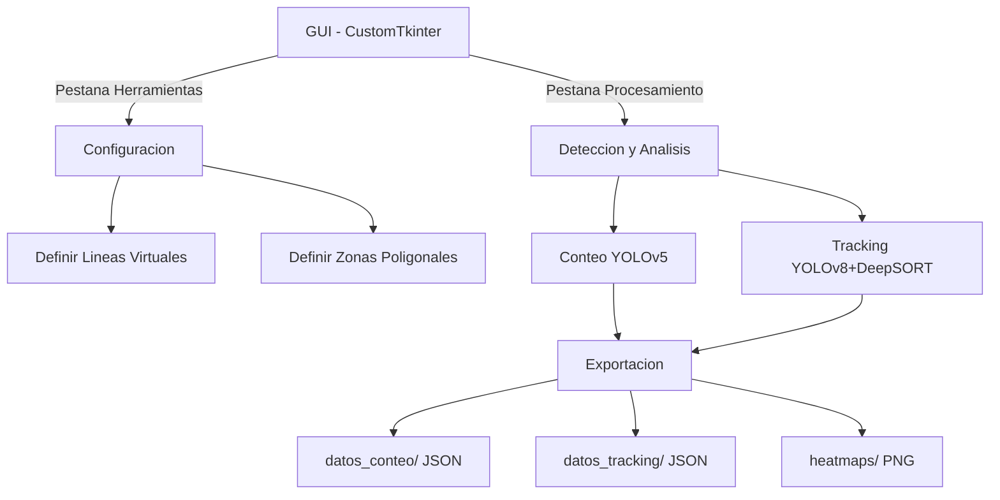

<div align="center">


# Sistema de Conteo y Seguimiento de Personas en Farmacias

**Analisis avanzado de comportamiento de clientes mediante vision por ordenador**

[](https://python.org)
[](https://github.com/ultralytics/yolov5)
[](https://github.com/ultralytics/ultralytics)
[](https://opencv.org)
[](LICENSE)

<br>

[**Read in English**](README.md)

</div>

---

## Resumen

Trabajo Fin de Master (TFM): sistema en tiempo real para **conteo y seguimiento de personas** en farmacias usando deep learning. Detecta clientes con YOLO, los rastrea con DeepSORT, analiza tiempo de permanencia por zona y genera mapas de calor — todo con **privacidad RGPD** integrada (pixelado en tiempo real, procesamiento 100% local).

---

## Caracteristicas

<table>
<tr>
<td width="50%">

**Deteccion y Conteo**
- Deteccion de personas con YOLOv5 y lineas virtuales de conteo
- Seguimiento de entradas/salidas en tiempo real
- Umbrales de confianza configurables
- Exportacion JSON de todos los datos

</td>
<td width="50%">

**Tracking y Analitica**
- YOLOv8 + DeepSORT para seguimiento persistente
- Definicion de zonas poligonales con tiempo de permanencia
- Generacion automatica de mapas de calor
- Historial de trayectorias y zonas por persona

</td>
</tr>
<tr>
<td width="50%">

**Privacidad y Cumplimiento**
- Pixelado en tiempo real (activar con tecla `P`)
- Procesamiento 100% local — sin transmision externa
- Cumplimiento RGPD por diseno

</td>
<td width="50%">

**Interfaz Grafica**
- GUI de escritorio con CustomTkinter
- Herramientas interactivas de configuracion
- Vista previa de video integrada
- Inicio/parada con un clic

</td>
</tr>
</table>

---

## Galeria

### Interfaz Principal

|  |  |
| :---: | :---: |
| *Panel de control* | *Procesamiento y controles en tiempo real* |

### Herramientas de Configuracion

|  |  |
| :---: | :---: |
| *Lineas virtuales de conteo* | *Definicion de zonas poligonales* |

### Conteo y Seguimiento

|  |  |
| :---: | :---: |
| *Conteo de personas en tiempo real* | *Pixelado de privacidad activado* |

|  |  |
| :---: | :---: |
| *Seguimiento de trayectorias DeepSORT* | *Mapa de calor generado* |

---

## Arquitectura



---

## Inicio Rapido

### Requisitos

- Python 3.8+
- pip

### Instalacion

```bash
git clone https://github.com/patatapython/Sistema-Tracking-Farmacia.git
cd Sistema-Tracking-Farmacia
python -m venv venv
source venv/bin/activate  # Linux/Mac
# venv\Scripts\activate   # Windows
pip install -r requirements.txt
```

### Descargar Modelos YOLO

```bash
# YOLOv5s (~15MB)
wget https://github.com/ultralytics/yolov5/releases/download/v7.0/yolov5s.pt
# YOLOv8s (~22MB)
wget https://github.com/ultralytics/assets/releases/download/v8.2.0/yolov8s.pt
```

### Ejecutar

```bash
python uiFarmacia_logo.py
```

---

## Uso

1. **Configurar** (pestana Herramientas): definir lineas de conteo y zonas poligonales interactivamente
2. **Procesar** (pestana Procesamiento): seleccionar fuente de video, iniciar conteo o tracking
3. **Analizar**: los resultados se exportan automaticamente a `datos_conteo/`, `datos_tracking/` y `heatmaps/`

<details>
<summary><b>Formatos de datos de salida</b></summary>

**Conteo** (`datos_conteo/*.json`):
```json
{
  "entradas": 15,
  "salidas": 12,
  "total_personas": 27,
  "personas_dentro": 3,
  "timestamp": "2025-09-05T14:42:45.598Z"
}
```

**Tracking** (`datos_tracking/*.json`):
```json
{
  "timestamp": "20250905_144534",
  "total_personas": 5,
  "sistema_tracking": "DeepSORT",
  "personas": [
    {
      "id": 1,
      "zona_actual": "mostrador",
      "tiempo_en_zona_actual": 45.2,
      "historial_zonas": [
        {
          "zona": "entrada",
          "tiempo_entrada": "2025-09-05T14:40:00",
          "tiempo_salida": "2025-09-05T14:40:30",
          "duracion": 30.0
        }
      ]
    }
  ]
}
```

</details>

---

## Estructura del Proyecto

```
Sistema-Tracking-Farmacia/
├── uiFarmacia_logo.py      Aplicacion GUI principal
├── conteo.py               Modulo de conteo con YOLOv5
├── tracking.py             Modulo de tracking YOLOv8 + DeepSORT
├── crear_linea.py          Creador interactivo de lineas de conteo
├── crear_zonas.py          Creador interactivo de zonas poligonales
├── config/                 Archivos de configuracion (lineas y zonas)
├── datos_conteo/           Resultados de conteo (JSON)
├── datos_tracking/         Resultados de tracking (JSON)
├── heatmaps/               Mapas de calor generados (PNG)
├── extras/Imagenes/        Capturas de pantalla
├── Logo/                   Logo de la aplicacion
└── requirements.txt        Dependencias Python
```

---

## Creditos

Desarrollado como **Trabajo Fin de Master (TFM)** por **Guillermo** — [patatapython](https://github.com/patatapython/)

Agradecimientos:
- [Ultralytics](https://ultralytics.com/) por los modelos YOLO
- [OpenCV](https://opencv.org/) por las herramientas de vision por computadora

---

## Licencia

Distribuido bajo la Licencia MIT. Consulta [LICENSE](LICENSE) para mas informacion.

---

<div align="center">
<sub>Hecho con Python y vision por computadora open source</sub>
</div>
